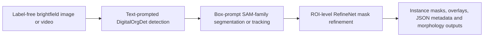

# DigitalOrg

**Paper title:** DigitalOrg integrates natural visual and organoid-domain priors for static and dynamic phenotyping in label-free organoid microscopy

DigitalOrg is a research codebase for text-prompted organoid detection, SAM-family mask generation, ROI-level mask refinement, and time-lapse morphology tracking. The repository contains the complete source scaffold, configuration templates, third-party backends required by the released pipeline, and representative qualitative examples. Model weights and datasets are intentionally not included.

## Workflow



## Repository layout

```text
DigitalOrg/
  configs/                         # YAML templates for models and datasets
  digitalorg/                       # high-level Python API and pipeline wrappers
  scripts/                          # image inference, video tracking, training and API entry points
  third_party/digitalorgdet_backend/ # bundled DigitalOrgDet detection backend
  third_party/sam3_repo/             # bundled SAM-family segmentation and refinement backend
  docs/assets/examples/              # representative README visual examples
  weights/README.md                  # checkpoint placement instructions
```

## Installation

```bash
git clone https://github.com/ucas-dx/DigitalOrg.git
cd DigitalOrg
python -m venv .venv
source .venv/bin/activate
pip install -e .
pip install -r requirements.txt
```

On Windows PowerShell, activate the environment with:

```powershell
.\.venv\Scripts\Activate.ps1
```

## Checkpoint and backend configuration

`configs/default.yaml` reads paths from environment variables. Keep large checkpoints outside Git.

```bash
export DIGITALORGDET_REPO=/path/to/DigitalOrg/third_party/digitalorgdet_backend
export SAM3_REPO=/path/to/DigitalOrg/third_party/sam3_repo
export DIGITALORGDET_MODEL=/path/to/digitalorgdet_model.yaml
export DIGITALORGDET_WEIGHT=/path/to/digitalorgdet_checkpoint.pt
export SAM3_BPE_PATH=/path/to/bpe_simple_vocab_16e6.txt.gz
export SAM3_CHECKPOINT=/path/to/sam3_checkpoint.pt
export DIGITALORG_REFINE_CHECKPOINT=/path/to/refine_checkpoint.pt
export CONVNEXT_CKPT=/path/to/convnext_checkpoint.pt
```

## Expected input formats

Image inference accepts common microscopy image formats such as `jpg`, `png`, `tif`, and `tiff`.

```text
inputs/
  image_001.tif
  image_002.png
```

Video tracking accepts an ordinary video file or a frame sequence converted to video.

```text
inputs/
  eb_timelapse.mp4
```

Detection training uses normalized YOLO-style labels.

```text
class_id x_center y_center width height
```

Example dataset structure:

```text
datasets/organoid_detection/
  images/train/*.jpg
  images/val/*.jpg
  labels/train/*.txt
  labels/val/*.txt
```

## Showcase 1: text-prompted phenotype detection

DigitalOrgDet uses text prompts as classifier anchors for phenotype-conditioned organoid detection. The examples below are representative qualitative outputs only.


```bash
PYTHONPATH=. python scripts/infer_image.py \
  --config configs/default.yaml \
  --image inputs/image_001.tif \
  --prompts "hollow organoid, solid organoid, apoptotic organoid" \
  --output-dir outputs/image_demo \
  --detect-conf 0.05 \
  --max-det 10
```

Outputs:

```text
outputs/image_demo/
  result.json
  detections.json
  overlay.jpg
  masks/*.png
```

## Showcase 2: ROI-level mask refinement

Detected boxes are used as geometric prompts for SAM-family coarse segmentation, followed by ROI-level RefineNet mask correction.


The pipeline stores both coarse and refined masks, allowing direct inspection of boundary refinement.

## Showcase 3: static organoid phenotype examples

Representative crops illustrate the type of brightfield morphology handled by the static image pipeline.


## Showcase 4: time-lapse tracking and refinement

For time-lapse sequences, DigitalOrgDet generates sparse geometric prompts on selected frames, SAM-family tracking propagates masks through the sequence, and RefineNet produces refined frame-wise masks.


```bash
PYTHONPATH=. python scripts/track_video_digitalorgdet_refine.py \
  --config configs/default.yaml \
  --video inputs/eb_timelapse.mp4 \
  --prompt "embryoid body" \
  --prompt-frames 0,20,40 \
  --detect-conf 0.05 \
  --max-det 5 \
  --output-dir outputs/video_demo
```

Outputs:

```text
outputs/video_demo/
  digitalorgdet_geo_prompts.json
  mask_index.json
  tracking_overlay_geo_boxes.mp4
  refine/refined_mask_index.json
  refine/tracking_overlay_refined.mp4
```

## API server

```bash
PYTHONPATH=. python scripts/run_api.py --config configs/default.yaml --host 0.0.0.0 --port 8088
```

Image inference endpoint:

```bash
curl -X POST http://127.0.0.1:8088/predict/image \
  -F image=@inputs/image_001.tif \
  -F prompts="hollow organoid, solid organoid" \
  -F detect_conf=0.05 \
  -F max_det=10 \
  -F output_dir=outputs/api_image_demo
```

Video inference endpoint:

```bash
curl -X POST http://127.0.0.1:8088/predict/video \
  -F video=@inputs/eb_timelapse.mp4 \
  -F prompt="embryoid body" \
  -F prompt_frames="0,20,40" \
  -F detect_conf=0.05 \
  -F max_det=5 \
  -F output_dir=outputs/api_video_demo
```

## Training DigitalOrgDet

Use `configs/dataset_template.yaml` as a starting point.

```bash
PYTHONPATH=. CUDA_VISIBLE_DEVICES=0 python scripts/train_digitalorgdet.py \
  --data configs/dataset_template.yaml \
  --config configs/default.yaml \
  --project runs/DigitalOrgdet \
  --name train_run \
  --epochs 100 \
  --batch 8 \
  --imgsz 640 \
  --workers 8
```

## Important notes

- This repository does not include trained weights, datasets, patient images, or private annotations.
- Keep model checkpoints, raw microscopy data, and experimental outputs outside Git.
- Review `THIRD_PARTY_NOTICES.md` before redistributing modified versions.
- The bundled backends are included for reproducibility of the released research pipeline; they retain their original licenses.

## License

DigitalOrg project-specific wrapper code is released under the GNU General Public License v3.0 or later. See `LICENSE` for the full text.

Third-party components under `third_party/` retain their original licenses. See `THIRD_PARTY_NOTICES.md` and the license files inside each third-party directory.
