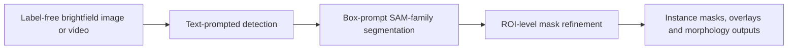
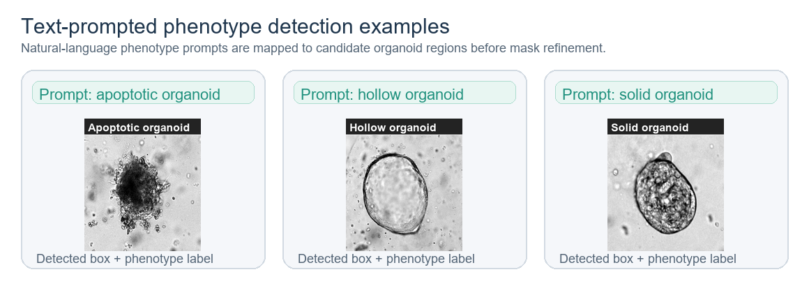
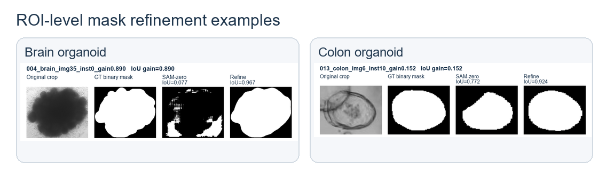
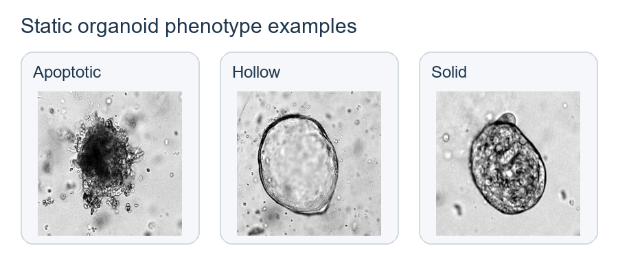
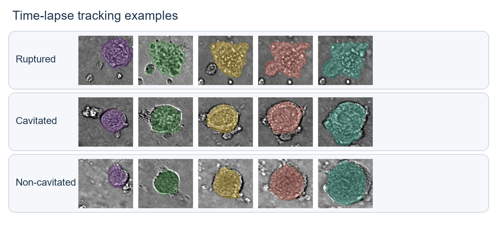

# DigitalOrg

**Paper title:** *DigitalOrg integrates natural visual and organoid-domain priors for static and dynamic phenotyping in label-free organoid microscopy*

DigitalOrg is a research code scaffold for label-free brightfield organoid analysis. The framework combines text-prompted detection, SAM-family box-prompt segmentation, and ROI-level morphology refinement to support static organoid analysis and time-lapse trajectory phenotyping.

This repository contains the inference and training scaffold. Model checkpoints are not included in the source package and must be configured locally.



## Core capabilities

| Function | Input | Main output | Script or API entry |
|---|---|---|---|
| Image-level organoid inference | One brightfield image and text prompts | Detections, refined masks, overlay | `scripts/infer_image.py` |
| Text-prompted organoid detection | Image plus phenotype descriptors | Box prompts and confidence scores | `digitalorg.detector.TextPromptDetector` |
| ROI mask refinement | Image, detected boxes, coarse SAM-family masks | Refined binary masks | `digitalorg.refiner.Sam3BoxRefiner` |
| Time-lapse tracking | Video plus sparse prompt frames | Frame-wise masks and refined tracking overlays | `scripts/track_video_digitalorgdet_refine.py` |
| API deployment | Image or video upload | JSON metadata, masks, overlays | `scripts/run_api.py` |
| Detector training scaffold | Detection dataset in normalized box-label format | Trained DigitalOrgdet detector checkpoint | `scripts/train_digitalorgdet.py` |


## Showcase 1: text-prompted phenotype detection

DigitalOrg accepts phenotype descriptors as text prompts and returns candidate organoid regions with detection scores. These boxes are then used as geometric prompts for SAM-family segmentation and ROI-level mask refinement.

<p align="center">
  
</p>

## Showcase 2: image inference and ROI-level mask refinement

The representative examples below are copied from existing DigitalOrg inference outputs. Each panel shows how ROI-level refinement improves instance-level organoid boundary delineation after box-prompt segmentation.

DigitalOrg first detects candidate organoids from a text prompt, uses the detected boxes as spatial prompts for SAM-family segmentation, and then refines the coarse masks with an ROI-level morphology refiner.

<p align="center">
  
</p>

### Example command

```bash
cd DigitalOrg
PYTHONPATH=. python scripts/infer_image.py \
  --config configs/default.yaml \
  --image data/demo_images/sample_001.png \
  --prompts "organoid" \
  --output-dir outputs/image_demo \
  --detect-conf 0.05 \
  --max-det 10
```

### Expected image input format

```text
data/demo_images/
├── sample_001.png
├── sample_002.jpg
└── sample_003.tif
```

Supported routine image extensions are `.png`, `.jpg`, `.jpeg`, `.tif`, and `.tiff`, provided that the configured detector and segmentation backend can read them through OpenCV or PIL-compatible loaders.

### Expected image output format

```text
outputs/image_demo/
├── result.json
├── detections.json
├── overlay.jpg
├── masks/
│   ├── instance_0000.png
│   ├── instance_0001.png
│   └── ...
└── sam_masks/                 # optional, enabled by save_sam_masks: true
    ├── instance_0000.png
    └── ...
```

`result.json` contains image-level metadata, prompt strings, detections, refined instance metadata, mask paths, and measured mask area. `detections.json` stores the detector output before mask refinement.

## Showcase 3: static organoid phenotype examples

Representative single-organoid crops are provided for common static brightfield phenotype categories. These images are intended as visual examples for the expected input appearance, not as bundled training data.

For static brightfield microscopy, DigitalOrg can be used to generate instance overlays for visual quality control, downstream morphology measurement, and phenotype-level review.

<p align="center">
  
</p>

A typical static analysis directory can be organized as follows:

```text
data/static_organoids/
├── images/
│   ├── field_0001.png
│   ├── field_0002.png
│   └── ...
├── prompts.txt                # optional list of phenotype descriptors
└── metadata.csv               # optional plate, well, time point, or sample metadata
```

Example prompt file:

```text
organoid
hollow organoid
solid organoid
apoptotic organoid
```


## Showcase 4: time-lapse tracking and refinement

Representative time-lapse rows show refined masks across multiple frames for different embryoid-body trajectory phenotypes.

For time-lapse brightfield videos, DigitalOrg can detect sparse prompt frames, propagate object identities with a SAM-family video tracker, and refine frame-wise masks for trajectory-level morphology analysis.

<p align="center">
  
</p>

### Example command using sparse prompt frames

```bash
cd DigitalOrg
PYTHONPATH=. python scripts/track_video_digitalorgdet_refine.py \
  --config configs/default.yaml \
  --video data/videos/eb_sequence_001.mp4 \
  --prompt "embryoid body" \
  --prompt-frames 0,48,96 \
  --detect-conf 0.05 \
  --max-det 5 \
  --output-dir outputs/video_demo
```

### Example command using existing geometric prompts

```bash
cd DigitalOrg
PYTHONPATH=. python scripts/track_video_digitalorgdet_refine.py \
  --config configs/default.yaml \
  --video data/videos/eb_sequence_001.mp4 \
  --geo-json data/geo_prompts/eb_sequence_001_geo_prompts.json \
  --output-dir outputs/video_demo_from_geo
```

### Expected video input format

```text
data/videos/
├── eb_sequence_001.mp4
├── eb_sequence_002.mp4
└── ...
```

Sparse geometric-prompt JSON format:

```json
{
  "video_path": "data/videos/eb_sequence_001.mp4",
  "prompt": "embryoid body",
  "detector": "DigitalOrgdet",
  "reuse_obj_ids_by_rank": false,
  "prompts": [
    {
      "frame_index": 0,
      "boxes_xyxy": [[120.0, 86.0, 238.0, 214.0]],
      "scores": [0.91]
    }
  ]
}
```

### Expected video output format

```text
outputs/video_demo/
├── digitalorgdet_geo_prompts.json
├── mask_index.json
├── tracking_overlay_geo_boxes.mp4
└── refine/
    ├── refined_mask_index.json
    └── tracking_overlay_refined.mp4
```

`digitalorgdet_geo_prompts.json` stores detected boxes on selected prompt frames. `mask_index.json` stores coarse tracking outputs. `refine/refined_mask_index.json` stores refined frame-wise mask metadata.


## Installation

```bash
git clone https://github.com/ucas-dx/DigitalOrg.git
cd DigitalOrg
pip install -e .
pip install -r requirements.txt
```

The repository is a lightweight scaffold. Install and configure third-party detector, SAM-family segmentation, and tracking backends according to your local environment.

## Configuration

`configs/default.yaml` uses environment variables for deployment-specific paths:

```bash
export DIGITALORGDET_REPO=/path/to/digitalorgdet_backend
export SAM3_REPO=/path/to/sam3
export DIGITALORGDET_MODEL=/path/to/digitalorgdet_model.yaml
export DIGITALORGDET_WEIGHT=/path/to/digitalorgdet_checkpoint.pt
export SAM3_BPE_PATH=/path/to/bpe_simple_vocab_16e6.txt.gz
export SAM3_CHECKPOINT=/path/to/sam3_checkpoint.pt
export DIGITALORG_REFINE_CHECKPOINT=/path/to/refine_checkpoint.pt
```

The same values can be written directly into `configs/default.yaml` if environment variables are not used.

## Detector training scaffold

Use `configs/dataset_template.yaml` as a starting point. The expected label format is normalized detection labels:

```text
class_id x_center y_center width height
```

Example dataset structure:

```text
data/detection_dataset/
├── train/
│   ├── images/
│   │   ├── img_0001.png
│   │   └── ...
│   └── labels/
│       ├── img_0001.txt
│       └── ...
├── val/
│   ├── images/
│   └── labels/
└── test/
    ├── images/
    └── labels/
```

Training command:

```bash
cd DigitalOrg
PYTHONPATH=. CUDA_VISIBLE_DEVICES=0 python scripts/train_digitalorgdet.py \
  --data configs/dataset_template.yaml \
  --config configs/default.yaml \
  --project runs/DigitalOrgdet \
  --name train_run \
  --epochs 100 \
  --batch 8 \
  --imgsz 640 \
  --workers 8
```

## API usage

Start the server:

```bash
cd DigitalOrg
PYTHONPATH=. python scripts/run_api.py --config configs/default.yaml --host 0.0.0.0 --port 8088
```

Image inference:

```bash
curl -X POST http://127.0.0.1:8088/predict/image \
  -F image=@data/demo_images/sample_001.png \
  -F prompts="organoid" \
  -F detect_conf=0.05 \
  -F max_det=10 \
  -F output_dir=outputs/api_image_demo
```

Video inference:

```bash
curl -X POST http://127.0.0.1:8088/predict/video \
  -F video=@data/videos/eb_sequence_001.mp4 \
  -F prompt="embryoid body" \
  -F prompt_frames="0,48,96" \
  -F detect_conf=0.05 \
  -F max_det=5 \
  -F output_dir=outputs/api_video_demo
```

Video inference from existing geometric prompts:

```bash
curl -X POST http://127.0.0.1:8088/predict/video_geo \
  -F video=@data/videos/eb_sequence_001.mp4 \
  -F geo_json=@data/geo_prompts/eb_sequence_001_geo_prompts.json \
  -F output_dir=outputs/api_video_geo_demo
```

## Notes

- This repository does not include model weights.
- Keep datasets and checkpoints outside version control unless redistribution is explicitly permitted.
- The included visual examples are documentation assets derived from existing DigitalOrg analysis outputs.
- Review third-party dependency licenses before redistribution.

## License

DigitalOrg is released under the GNU General Public License v3.0 or later. See [LICENSE](LICENSE) for the full license text.

## Citation

If you use DigitalOrg, please cite the associated manuscript once available.

```bibtex
@article{digitalorg,
  title   = {DigitalOrg integrates natural visual and organoid-domain priors for static and dynamic phenotyping in label-free organoid microscopy},
  author  = {DigitalOrg authors},
  journal = {Manuscript in preparation},
  year    = {2026}
}
```


